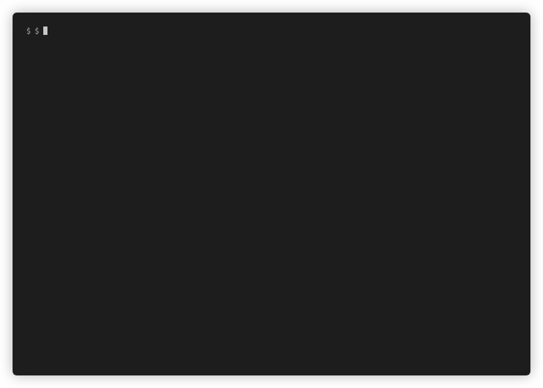

# lcat
Command line utility to read log files in the logstash json format. Run `lcat -h` for usage examples and parameters.

# Installation
## Cargo
Install [Rust](https://rustup.rs/), clone this repository and run:

`cargo install --path .`

## Nix
With Nix flakes enabled (for example installed using [DeterminateSystems/nix-installer](https://github.com/DeterminateSystems/nix-installer)), run:

`nix profile install github:SakulK/lcat`
